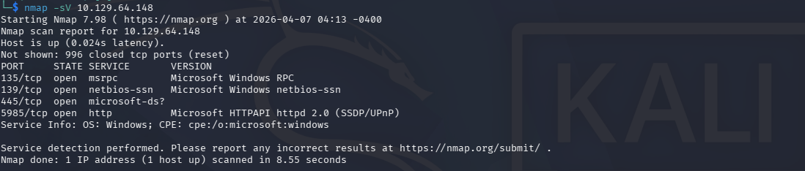
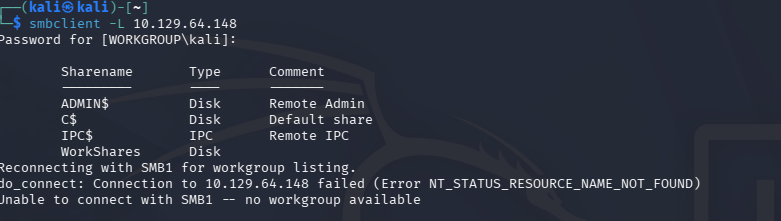
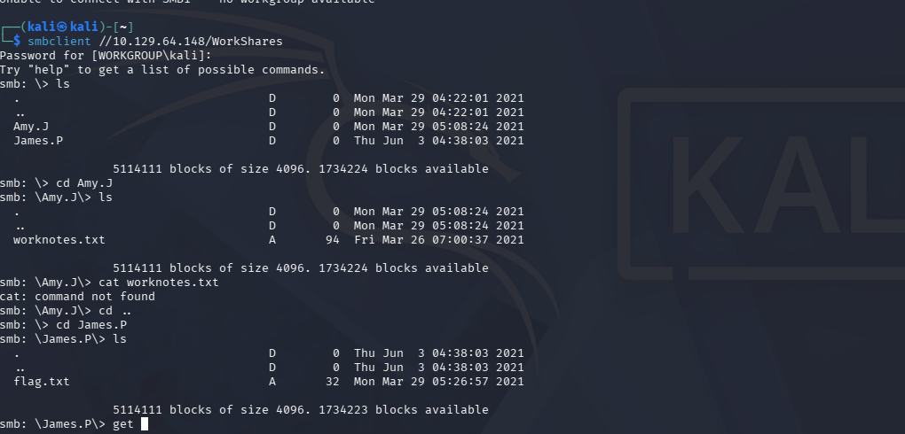

# Dancing

Platform: HackTheBox (Starting Point — Tier 0)
Difficulty: Very Easy
Date: 07/04/2026
Flag: `[REDACTED]`

Tags: `#htb` `#starting-point` `#smb` `#misconfiguration` `#anonymous-access`

---

## Recon

```bash
nmap -sV [TARGET]
```



SMB open on 445.

## Exploitation

List shares:

```bash
smbclient -L [TARGET]
```



4 shares. WorkShares opens without password.

```bash
smbclient \\\\[TARGET]\\WorkShares
```



Search in folders, find flag.txt in James.P, `get` and done.

Flag: `[REDACTED]`

---

## Notes

- Always enumerate shares, not just ports — `smbclient -L` or `enum4linux`
- Open SMB shares in real environments often have internal docs, creds, config files
