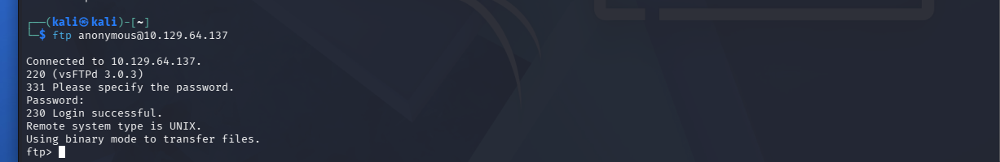
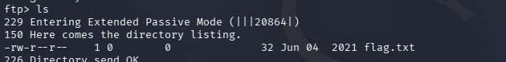

# Fawn

Platform: HackTheBox (Starting Point — Tier 0)
Difficulty: Very Easy
Date: 07/04/2026
Flag: `[REDACTED]`

Tags: `#htb` `#starting-point` `#ftp` `#misconfiguration` `#anonymous-access`

---

## Recon

```bash
nmap -sV [TARGET]
```

Port 21 open — vsftpd 3.0.3

## Exploitation

```bash
ftp anonymous@[TARGET]
```



No password needed. `ls` → flag.txt is there.



`get flag.txt`, open with `cat`, done.

Flag: `[REDACTED]`

---

## Notes

- Anonymous FTP = serious misconfig, anyone can browse and download
- FTP is cleartext like telnet — use SFTP instead
