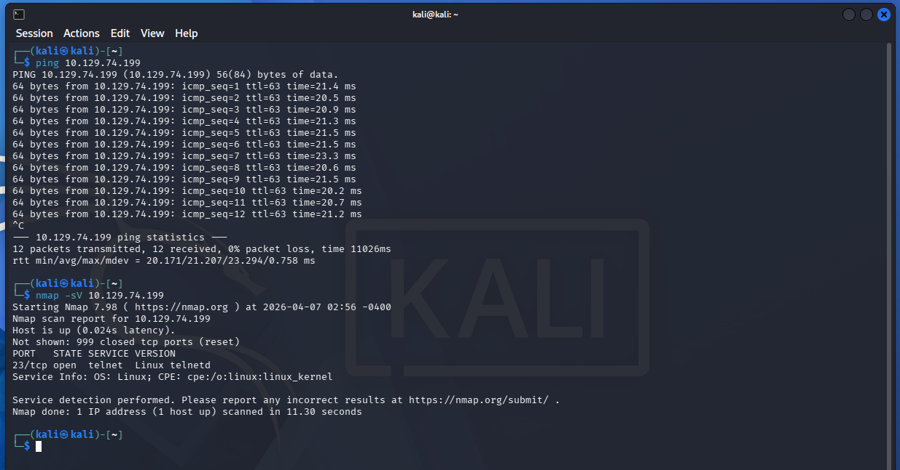
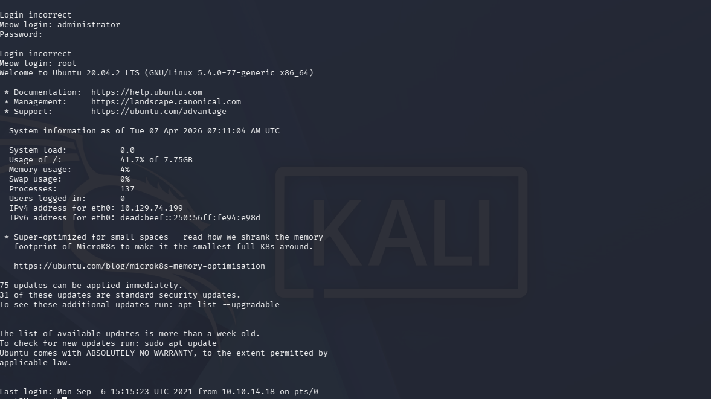
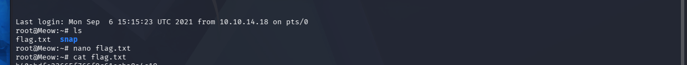

# Meow

Platform: HackTheBox (Starting Point — Tier 0)
Difficulty: Very Easy
OS: Linux
Date: 07/04/2026
Flag: `[REDACTED]`

Tags: `#htb` `#starting-point` `#telnet` `#misconfiguration` `#default-credentials`

---

## Box info

Meow is the first machine in the HackTheBox Starting Point track. It introduces the fundamentals: connecting to the VPN, running a basic scan, identifying an exposed service, and exploiting a default configuration to gain access.

Target IP: `[REDACTED]`

---

## Recon

### Nmap scan

```bash
nmap -sV [REDACTED]
```

Results:

```
PORT   STATE SERVICE VERSION
23/tcp open  telnet  Linux telnetd
```



### Interpretation

- Only one port open: **23/tcp (Telnet)**.
- Telnet transmits everything in cleartext — credentials included. Its presence on a live system is already a finding.
- No SSH, no HTTP, no other services. The attack surface is minimal but the single exposed service is inherently insecure.

---

## Exploitation

### Telnet connection

```bash
telnet [REDACTED]
```

The service presents a login prompt. No banner grabbing needed — it's a standard Linux login.

### Default credentials

Tried common default usernames with no password:

| Username | Result             |
| -------- | ------------------ |
| admin    | Access denied      |
| root     | **Access granted** |

Root login with an empty password. No authentication barrier at all.



Juste "ls" and see flag.txt



```bash
root@Meow:~# cat flag.txt
[REDACTED]
```

The flag is in the root home directory. Full system access on the first attempt.

---

## Lessons learned

1. **Telnet should never be exposed.** It has no encryption. Any credentials sent over it can be captured with a simple packet sniffer. SSH exists for a reason.

2. **Default and empty credentials are still one of the most common attack vectors.** This box simulates what happens in real environments — devices shipped with factory defaults that nobody changes.

3. **Root login without a password is a critical misconfiguration.** Even on internal networks, this violates the principle of least privilege and makes lateral movement trivial for an attacker.

4. **Minimal attack surface does not mean secure.** One badly configured service is enough to compromise an entire system.

---

## Hardening

How to fix the issues found on this box in a real environment:

1. **Disable Telnet entirely** — it transmits everything in cleartext. Replace it with SSH (port 22) using key-based authentication instead of passwords.

2. **Disable root login over the network** — even with SSH, direct root login should be disabled. In `/etc/ssh/sshd_config`: `PermitRootLogin no`. Users should connect with their own account and elevate with sudo.

3. **Enforce strong passwords** — never leave accounts with empty or default passwords. Use a password policy (minimum length, complexity) and ideally a password manager.

4. **Reduce attack surface** — only run services that are actually needed. Every open port is a potential entry point.

5. **Monitor login attempts** — use fail2ban or similar tools to block brute-force attempts, and centralize logs to detect suspicious activity.
