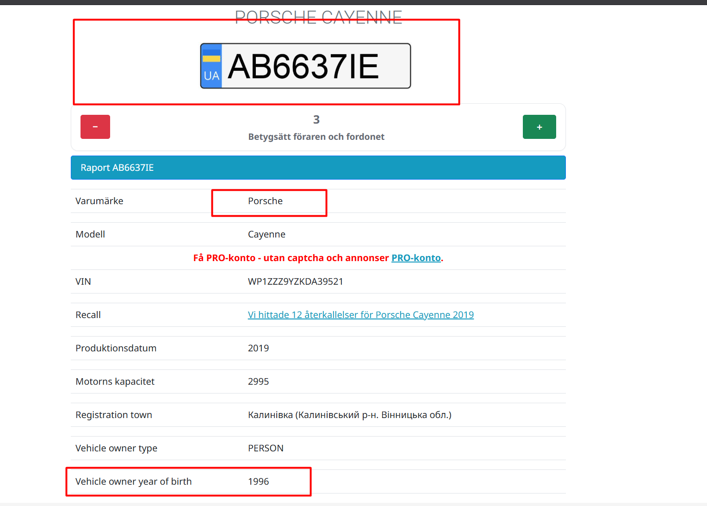

# Operation LOCKERGOGA

Platform: OSINT Industries CTF
Category: OSINT
Difficulty: Hard
Date: 14/04/2026
Flag: `[REDACTED]`

Tags: `#osint` `#osint-industries` `#ransomware` `#vehicle` `#socmint` `#ukraine`

---

## Context

Target: Volodymyr TYMOSHCHUK (ТИМОЩУК), born 02/10/1996, France/Ukraine. Deployed **LOCKERGOGA ransomware** on hundreds of companies (2018-2020), $18B+ damages.

Find: licence plate, brand, model, year, mileage of his vehicle.

Format: `OSINT{plate, brand, model, year, mileage}`

---

## Walkthrough

### Username hunting

Tried all probable usernames. Only **@volotmsk___** on Instagram gave results.

Cybercriminals use multiple aliases — gotta try them all and see which ones stick.

### Vehicle from Instagram

One post shows a black Porsche, Cayenne shape. Ukrainian plate readable: **AB 6637 IE**.

### Plate lookup

Ukrainian vehicle registry confirms:

Birth year matches (1996), VIN available. **Porsche Cayenne, 2019**.

### Mileage from stories

In a highlighted story, dude is driving. High seat position = SUV. Dashboard visible: **36 921 km**.

Flag: `[REDACTED]`

---

## Notes

- Young cybercriminals flex their ransomware money on Instagram — cars, watches, travel. That's how they get caught
- Ukrainian plates: XX 0000 XX format
- Always check Instagram highlights/stories — more careless info than regular posts
