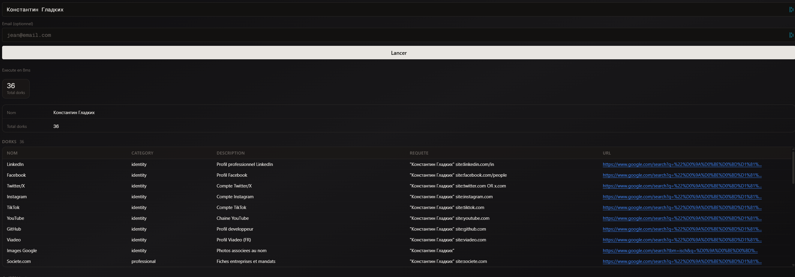

# Taste of Influence — Parts 2, 3 & 4

Platform: OSINT Industries CTF
Category: OSINT
Difficulty: Medium
Date: 14/04/2026
Flag: `[REDACTED]`

Tags: `#osint` `#osint-industries` `#vk` `#socmint`

---

## Context

4-part challenge about a chef. From Part 1 we already have:
- **Name:** Константин Гладких (Konstantin Gladkikh)
- **Festival:** GA5TREET
- **Profile:** [gronda.com/@konstantin-gladkix](https://gronda.com/@konstantin-gladkix)

Parts 2-4: find his email, phone, and Strava ID.

---

## Part 2 — Email

Google Dorks on "Константин Гладких" with Prism — 36 dorks generated.

VK is always a goldmine for Russian targets. Found his VK profile, grabbed the ID, used a third-party archive service to pull cached info.

Email recovered from the archives.

Flag: `[REDACTED]`

## Part 3 — Phone (last 4 digits)

Same VK archives from Part 2 had phone data too. Grabbed the last 4 digits.

Flag: `[REDACTED]`

## Part 4 — Strava ID

Strava search doesn't work well without an account. Created a sock puppet, searched his name, found the profile, grabbed the numeric ID from the URL.

Flag: `[REDACTED]`

---

## Notes

- Russian targets → VK first, always. Tons of PII through archives
- Search in original Cyrillic, not transliterated
- Strava needs a sock puppet to search properly
